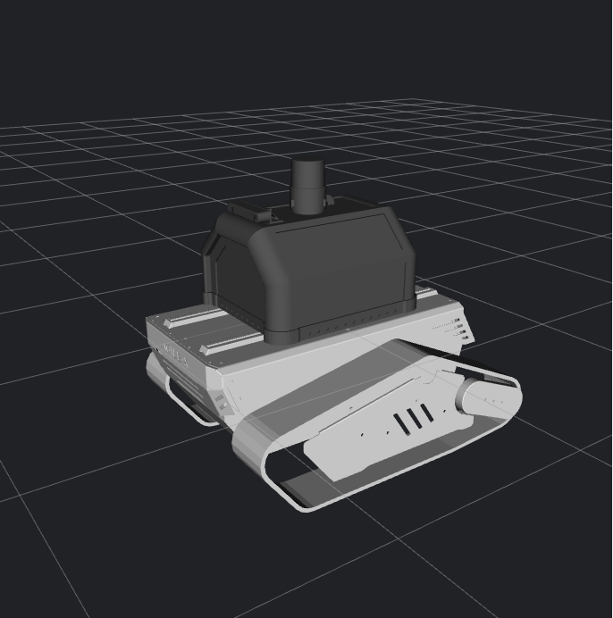
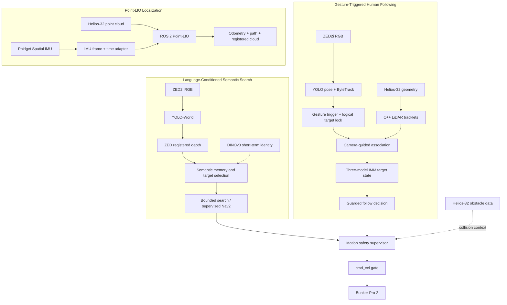
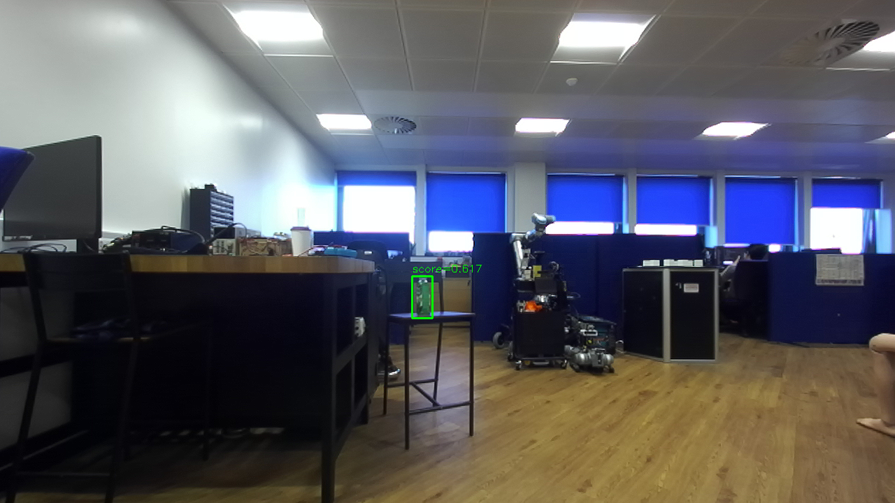
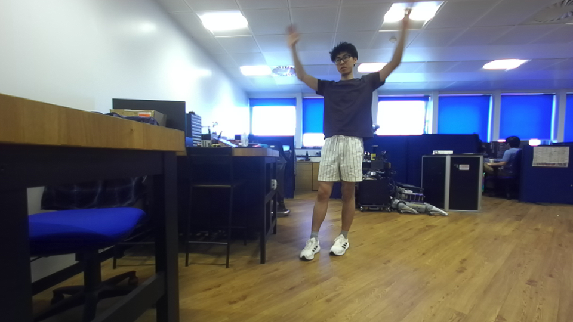
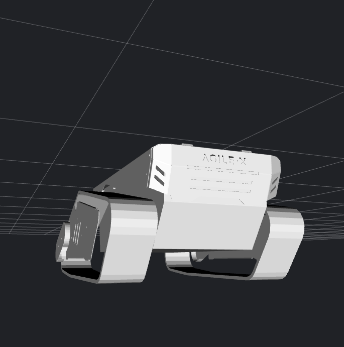
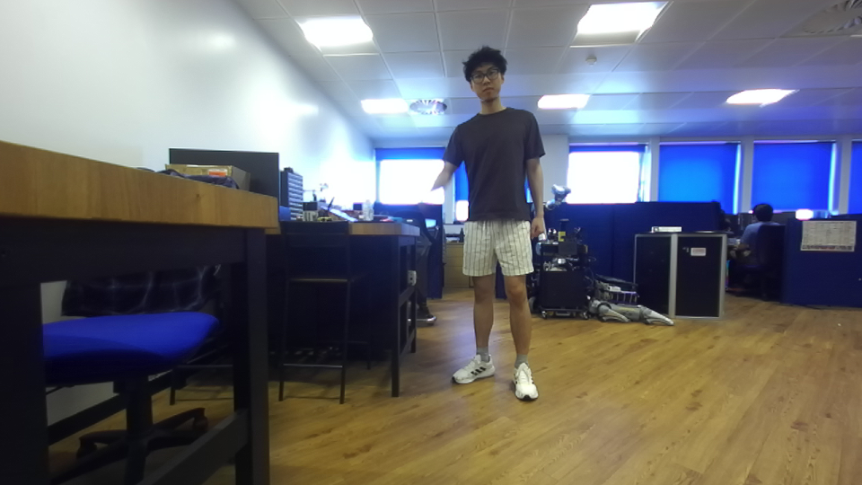

<div align="center">

# Track Robot Workspace

**A ROS 2 autonomy stack for language-guided object search, gesture-authorized human following, and LiDAR-inertial localization on Bunker Pro 2.**




</div>

## Core Capabilities

<table>
  <tr>
    <td width="33%" valign="top">
      <h3>Find → Remember → Approach</h3>
      <p>Search for objects in natural language, ground detections in 3D, maintain bounded semantic memory, and hand an approved target to supervised navigation.</p>
    </td>
    <td width="33%" valign="top">
      <h3>Gesture → Lock → Follow</h3>
      <p>Use pose gestures to authorize a logical person lock, combine camera identity with LiDAR geometry, and maintain a guarded target state for following.</p>
    </td>
    <td width="33%" valign="top">
      <h3>Sense → Estimate → Map</h3>
      <p>Fuse RoboSense Helios-32 clouds with Phidget IMU measurements through the ROS 2 Point-LIO port for odometry, path, and registered-cloud output.</p>
    </td>
  </tr>
</table>

## System Architecture

The capabilities share sensors and safety infrastructure, but each pipeline can be launched and validated independently.



Semantic position in the active ZED-depth profile comes from registered camera depth. LiDAR supplies obstacle and motion-safety context there; it is not presented as the source of semantic object position.

## Demo Gallery

<table>
  <tr>
    <td width="33%" align="center"></td>
    <td width="33%" align="center"></td>
    <td width="33%" align="center"></td>
  </tr>
  <tr>
    <td align="center"><strong>Semantic search</strong><br><sub>Real YOLO-World overlay from a recorded workspace run.</sub></td>
    <td align="center"><strong>Human tracking source</strong><br><sub>Raw, unannotated ZED rosbag source frame; no inference overlay is shown.</sub></td>
    <td align="center"><strong>Robot model</strong><br><sub>Repository-owned Bunker Pro 2 URDF visualized in RViz.</sub></td>
  </tr>
</table>

## Semantic Search

### Find → Remember → Approach

Track Robot accepts a short English object description and turns it into a bounded perception-and-navigation task:

```text
ZED2i RGB
  → YOLO-World open-vocabulary detection
  → ZED registered depth for 3D grounding
  → semantic memory and target selection
  → bounded active search or supervised Nav2 approach
```

DINOv3 can support short-term visual identity across observations. The motion-capable stages remain operator-supervised and route velocity through the normal safety supervisor and command gate.

Start with the [Phase 0–3 passive YOLO-World guide](track_robot_ws/docs/guides/semantic-search/phase0-3-yolo-world-test.md). The [Phase 4B supervised Nav2 guide](track_robot_ws/docs/guides/semantic-search/phase4b-nav2-supervised-test.md) and [Phase 5A bounded active-search guide](track_robot_ws/docs/guides/semantic-search/phase5a-bounded-active-search-test.md) contain the motion authorization and validation procedures.

## Human Following

### Gesture → Lock → Follow

The camera pipeline uses YOLO pose and ByteTrack to identify people. A two-hand start gesture authorizes a logical target lock; generic LiDAR tracklets then provide 3D geometry to camera-guided association and a three-model IMM target estimator. Camera semantics remain authoritative for identity, while LiDAR provides bounded continuation when the selected person leaves the camera field of view.

<div align="center">
  
  <br>
  <sub>Later raw, unannotated ZED frame from the same human-tracking rosbag sequence, with the subject visible at the right side of the test scene; it is source data rather than annotated model output.</sub>
</div>

Follow decisions preserve RC takeover, explicit re-lock, explicit safety arming, the motion safety supervisor, and the velocity gate. The tracking-only quick start below does not launch a follow controller or publish a base command.

See the [human-tracking implementation guide](track_robot_ws/src/track_robot_perception/docs/human_tracking_progress.md), [reinforcement and safety notes](track_robot_ws/src/track_robot_perception/docs/human_tracking_reinforcement.md), and [offline rosbag replay guide](track_robot_ws/docs/guides/human-tracking/rosbag-replay.md).

## Point-LIO

### Sense → Estimate → Map

The local ROS 2 Foxy port accepts the native RoboSense Helios-32 `PointCloud2` layout. The Phidget IMU adapter rotates measurements into the LiDAR/body frame and applies the configured timestamp offset before Point-LIO consumes them.

```text
/rslidar_points + /imu/data_raw
  → /imu/data_lio
  → Point-LIO
  → /aft_mapped_to_init, /path, /cloud_registered, /Laser_map
```

The [Point-LIO RS-Helios integration guide](track_robot_ws/src/track_robot_perception/docs/point_lio_rshelios.md) documents launch modes, expected topics, calibration parameters, drift capture, and offset-sweep tools.

## Quick Start

Clone and build the ROS workspace:

```bash
git clone https://github.com/ZZY5825/Track-robot-workspace.git
cd Track-robot-workspace/track_robot_ws
source /opt/ros/foxy/setup.bash
colcon build --symlink-install
source install/setup.bash
export ROS_DOMAIN_ID=20
```

### Passive semantic perception

This Phase 1 entry point starts camera perception and does not launch navigation or publish `/cmd_vel`:

```bash
ros2 run track_robot_bringup semantic_search_ctl start phase1 --hardware auto
ros2 run track_robot_bringup semantic_search_ctl query "green bottle"
```

Stop processes owned by the semantic-search controller when finished:

```bash
ros2 run track_robot_bringup semantic_search_ctl stop
```

### Tracking-only human pipeline

With ZED image/calibration topics and `/rslidar_points` already available:

```bash
ros2 launch track_robot_perception human_tracking_simplified.launch.py
```

This launch performs camera tracking, gesture lock, LiDAR tracklets, association, and target-state estimation. It does not start the Bunker driver or follow controller.

### Point-LIO localization

With `/rslidar_points` and `/imu/data_raw` already available:

```bash
ros2 launch track_robot_perception point_lio_rshelios.launch.py
```

Use the integration guide for the launch mode that also owns the LiDAR network and IMU driver.

> Model checkpoints and recordings are local dependencies and are intentionally not committed. Review each feature guide for expected paths, model hashes, calibration, and hardware preflight.

## Hardware and Software Stack

| Layer | Active components |
|---|---|
| Mobile base | AgileX Bunker Pro 2 tracked platform |
| Compute | NVIDIA Jetson AGX Orin |
| RGB-D camera | Stereolabs ZED2i |
| LiDAR | RoboSense RS-Helios-32 |
| IMU | Phidget Spatial IMU |
| Middleware | Ubuntu 20.04, ROS 2 Foxy |
| Semantic perception | YOLO-World, ZED registered depth, DINOv3 short-term identity |
| Human perception | YOLOv8 pose, ByteTrack, C++ LiDAR tracklets, three-model IMM |
| Localization | ROS 2 Point-LIO port and IMU frame/time adapter |
| Navigation | Nav2 with bounded search and supervised approach workflows |
| Motion safety | RC takeover, explicit authorization, motion safety supervisor, `cmd_vel` gate |

## Documentation

- [Operator guides](track_robot_ws/docs/guides/README.md)
- [Semantic-search package](track_robot_ws/src/track_robot_semantic_search/README.md)
- [Human-tracking implementation](track_robot_ws/src/track_robot_perception/docs/human_tracking_progress.md)
- [Human-tracking rosbag replay](track_robot_ws/docs/guides/human-tracking/rosbag-replay.md)
- [Point-LIO RS-Helios integration](track_robot_ws/src/track_robot_perception/docs/point_lio_rshelios.md)
- [Perception workspace](track_robot_ws/src/track_robot_perception/README.md)
- [Release history](RELEASES.md)
