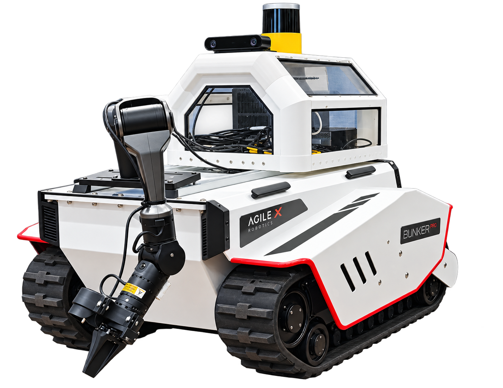
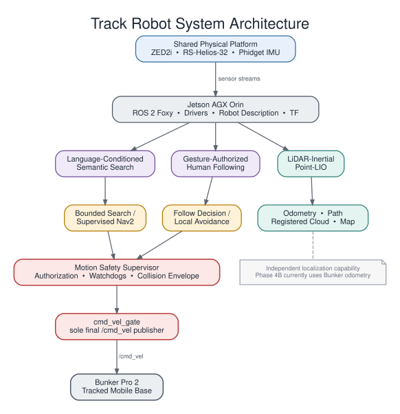
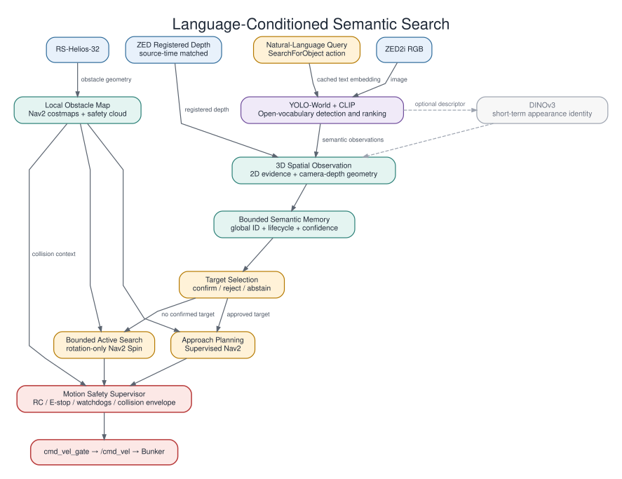
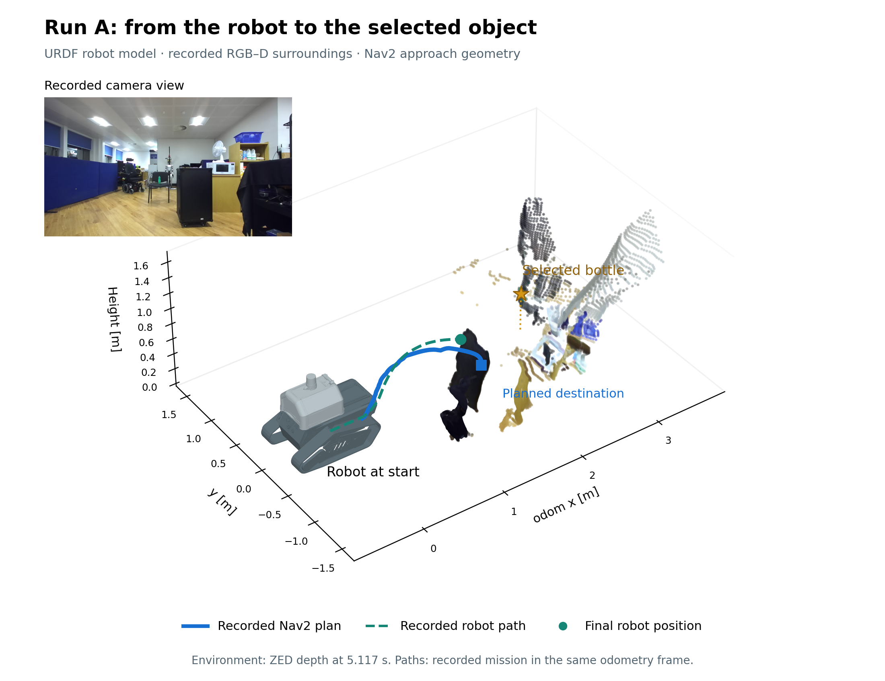
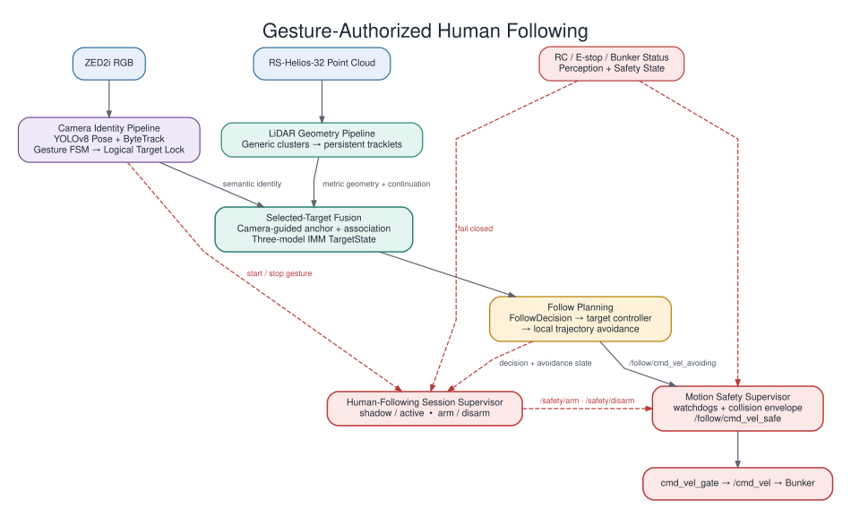
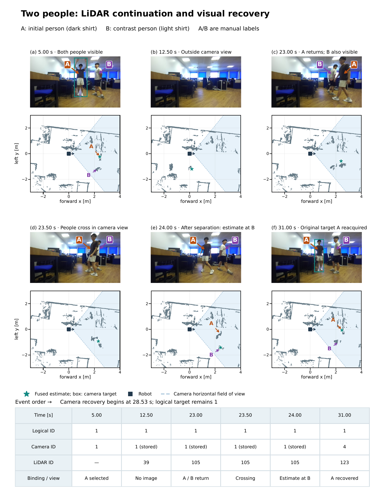
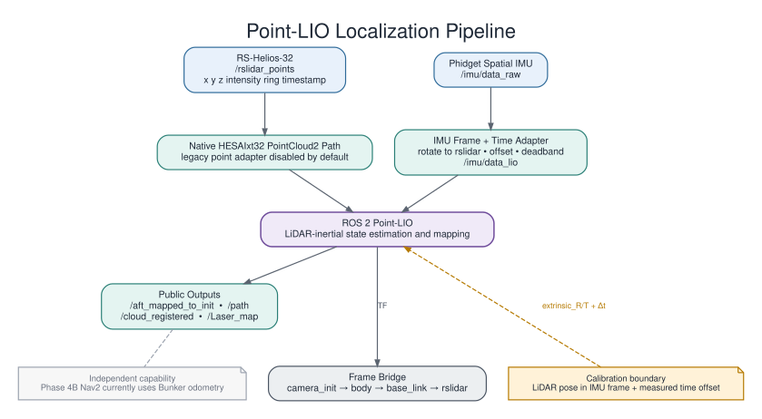
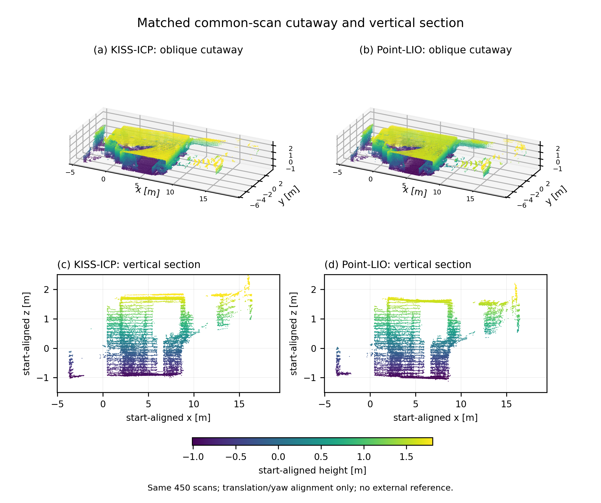
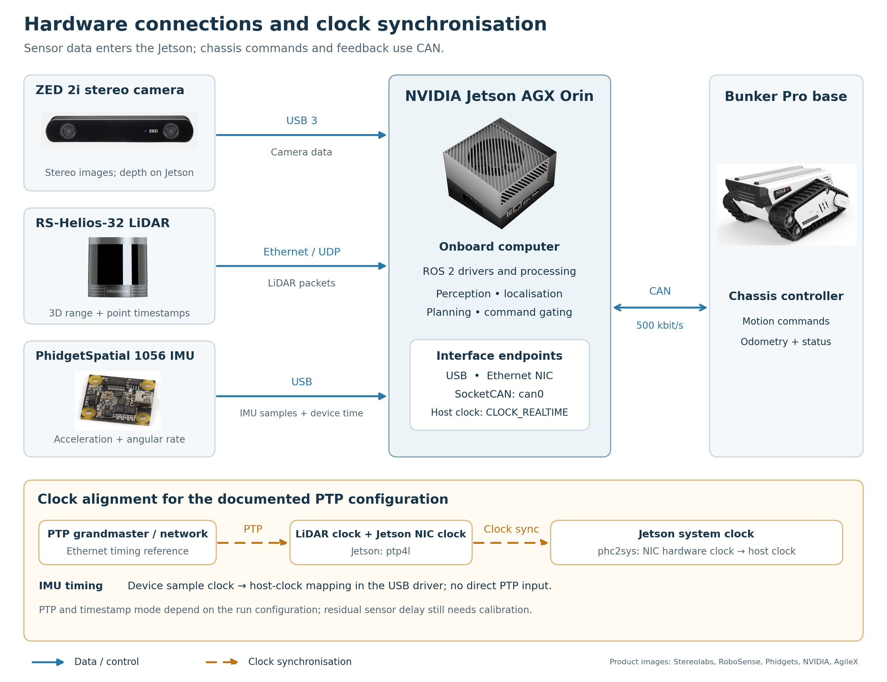

<div align="center">

# Track Robot Workspace

**A ROS 2 robot that follows a selected person, estimates its motion, and approaches objects requested in language.**




</div>

Built on an AgileX Bunker Pro with a ZED 2i, Helios-32 LiDAR, Phidget IMU and Jetson AGX Orin. This project brings together mechanical integration, camera–LiDAR perception, localisation and supervised navigation.

**[Quick start](#quick-start)** · [Hardware](#hardware-and-software-stack) · [Documentation](#documentation) · [Project thesis](https://github.com/ZZY5825/agilex-bunker-thesis/blob/main/output/pdf/agilex-bunker-thesis-revision-2-32.pdf)

## Core Capabilities

<table>
  <tr>
    <td width="33%" valign="top">
      <h3>Find → Remember → Approach</h3>
      <p>Search for objects in natural language, ground detections in 3D, maintain bounded semantic memory, and hand an approved target to supervised navigation.</p>
    </td>
    <td width="33%" valign="top">
      <h3>Gesture → Lock → Follow</h3>
      <p>Use pose gestures to authorize a logical person lock, combine camera identity with LiDAR geometry, and maintain a guarded target state for following.</p>
    </td>
    <td width="33%" valign="top">
      <h3>Sense → Estimate → Map</h3>
      <p>Fuse RoboSense Helios-32 clouds with Phidget IMU measurements through the ROS 2 Point-LIO port for odometry, path, and registered-cloud output.</p>
    </td>
  </tr>
</table>

## System Architecture

The capabilities share sensors and safety infrastructure, but each pipeline can be launched and validated independently.

<div align="center">
  
  <br>
  <sub>Solid arrows show runtime data flow; dashed gray links mark intentionally independent or non-integrated relationships.</sub>
</div>

Semantic position in the active ZED-depth profile comes from registered camera depth. LiDAR supplies obstacle and motion-safety context there; it is not presented as the source of semantic object position.

## Semantic Search

### Find → Remember → Approach

Track Robot accepts a short English object description and turns it into a bounded perception-and-navigation task:

<details>
<summary>Software pipeline: object search and approach</summary>

<div align="center">
  
</div>

</details>



*From a selected bottle to an approach destination: the blue curve is the recorded Nav2 plan, and the dashed green curve is the robot path. The scene combines the robot model with recorded ZED depth in the mission's odometry frame.*

DINOv3 descriptors supplement visual association. A separate offline study in the thesis also evaluates persistent appearance memory that reconnects the selected identity after the camera ID changes. [See the recovery comparison](https://github.com/ZZY5825/agilex-bunker-thesis/blob/main/imgs/chapter4/dino-persistent-identity-comparison-v3.pdf).

Approach missions remain operator-supervised, with velocity requests passing through the safety supervisor and command gate.

Start with the [Phase 0–3 passive YOLO-World guide](track_robot_ws/docs/guides/semantic-search/phase0-3-yolo-world-test.md). The [Phase 4B supervised Nav2 guide](track_robot_ws/docs/guides/semantic-search/phase4b-nav2-supervised-test.md) and [Phase 5A bounded active-search guide](track_robot_ws/docs/guides/semantic-search/phase5a-bounded-active-search-test.md) contain the motion authorization and validation procedures.

## Human Following

### Gesture → Lock → Follow

The camera pipeline uses YOLO pose and ByteTrack to identify people. A two-hand start gesture authorizes a logical target lock; generic LiDAR tracklets then provide 3D geometry to camera-guided association and a three-model IMM target estimator. Camera semantics remain authoritative for identity, while LiDAR provides bounded continuation when the selected person leaves the camera field of view.

<details>
<summary>Software pipeline: person tracking and following</summary>

<div align="center">
  
</div>

</details>

[](docs/assets/readme/research/person-tracking.png)

*The development replay shows position support from LiDAR during visual absence and recovery of the selected person A after the crossing. The event strip aligns camera IDs, LiDAR tracks and target binding, including the temporary association with B.*

Follow decisions pass through sampled differential-drive local trajectory avoidance before an independent safety supervisor checks the selected arc, command freshness, Bunker health, and RC takeover state. Returning from RC to CAN mode never resumes motion automatically; a new gesture-authorized target session is required. The tracking-only quick start below does not launch a follow controller or publish a base command.

See the [human-tracking implementation guide](track_robot_ws/src/track_robot_perception/docs/human_tracking_progress.md), [reinforcement and safety notes](track_robot_ws/src/track_robot_perception/docs/human_tracking_reinforcement.md), [offline rosbag replay guide](track_robot_ws/docs/guides/human-tracking/rosbag-replay.md), and [supervised live test procedure](track_robot_ws/docs/guides/human-following/live-supervised-test.md).

## Point-LIO

### Sense → Estimate → Map

The local ROS 2 Foxy port accepts the native RoboSense Helios-32 `PointCloud2` layout. The Phidget IMU adapter rotates measurements into the LiDAR/body frame and applies the configured timestamp offset before Point-LIO consumes them.

<details>
<summary>Software pipeline: Point-LIO integration</summary>

<div align="center">
  
</div>

</details>

[](docs/assets/readme/research/localisation-cutaway.png)

*The thesis compares both methods on the same indoor recording. Matching 450 scans and the viewing geometry reveals similar structural bands and differences in vertical spread.*

The [Point-LIO RS-Helios integration guide](track_robot_ws/src/track_robot_perception/docs/point_lio_rshelios.md) documents launch modes, expected topics, calibration parameters, drift capture, and offset-sweep tools.

## Quick Start

Clone and build the ROS workspace:

```bash
git clone https://github.com/ZZY5825/Track-robot-workspace.git
cd Track-robot-workspace/track_robot_ws
source /opt/ros/foxy/setup.bash
colcon build --symlink-install
source install/setup.bash
export ROS_DOMAIN_ID=20
```

### Passive semantic perception

This Phase 1 entry point starts camera perception and does not launch navigation or publish `/cmd_vel`:

```bash
ros2 run track_robot_bringup semantic_search_ctl start phase1 --hardware auto
ros2 run track_robot_bringup semantic_search_ctl query "green bottle"
```

Stop processes owned by the semantic-search controller when finished:

```bash
ros2 run track_robot_bringup semantic_search_ctl stop
```

### Tracking-only human pipeline

With ZED image/calibration topics and `/rslidar_points` already available:

```bash
ros2 launch track_robot_perception human_tracking_simplified.launch.py
```

This launch performs camera tracking, gesture lock, LiDAR tracklets, association, and target-state estimation. It does not start the Bunker driver or follow controller.

### Shadow-mode human following

The supervised runtime starts in shadow mode without a `/cmd_vel` publisher:

```bash
ros2 run track_robot_bringup human_following_ctl doctor \
  --runtime-mode shadow --hardware auto
ros2 run track_robot_bringup human_following_ctl start \
  --runtime-mode shadow --hardware auto
```

Use `human_following_ctl stop` to stop only processes owned by this feature. Do
not enable active motion from this quick start. Follow the staged
[live supervised test procedure](track_robot_ws/docs/guides/human-following/live-supervised-test.md), beginning with Gate A, before any physical test.

### Point-LIO localization

With `/rslidar_points` and `/imu/data_raw` already available:

```bash
ros2 launch track_robot_perception point_lio_rshelios.launch.py
```

Use the integration guide for the launch mode that also owns the LiDAR network and IMU driver.

> Model checkpoints and recordings are local dependencies and are intentionally not committed. Review each feature guide for expected paths, model hashes, calibration, and hardware preflight.

## Hardware and Software Stack

[](docs/assets/readme/research/hardware-connections.png)

*USB and Ethernet carry camera, inertial and LiDAR data to the Jetson; CAN connects the chassis. The lower panel separates network clock synchronisation from the IMU's clock mapping.*

[Explore the enclosure assembly](https://github.com/ZZY5825/agilex-bunker-thesis/blob/main/imgs/hardware/robot-hardware-assembly-v1.pdf) · [Robot and arm model](docs/assets/readme/track-robot-hero.png)

PiPER is integrated into the combined URDF, JointState, and TF model; arm control is outside the current autonomy runtime. The arm-mounted L515 is a visual model and is not presented as an active camera driver.

| Layer | Active components |
|---|---|
| Mobile base | AgileX Bunker Pro 2 tracked platform |
| Compute | NVIDIA Jetson AGX Orin |
| RGB-D camera | Stereolabs ZED2i |
| LiDAR | RoboSense RS-Helios-32 |
| IMU | Phidget Spatial IMU |
| Middleware | Ubuntu 20.04, ROS 2 Foxy |
| Semantic perception | YOLO-World, ZED registered depth, DINOv3 short-term identity |
| Human perception | YOLOv8 pose, ByteTrack, C++ LiDAR tracklets, three-model IMM |
| Localization | ROS 2 Point-LIO port and IMU frame/time adapter |
| Navigation | Nav2 with bounded search and supervised approach workflows |
| Motion safety | RC takeover, explicit authorization, motion safety supervisor, `cmd_vel` gate |

## Documentation

- [Operator guides](track_robot_ws/docs/guides/README.md)
- [Semantic-search package](track_robot_ws/src/track_robot_semantic_search/README.md)
- [Human-tracking implementation](track_robot_ws/src/track_robot_perception/docs/human_tracking_progress.md)
- [Human-tracking rosbag replay](track_robot_ws/docs/guides/human-tracking/rosbag-replay.md)
- [Supervised live human following](track_robot_ws/docs/guides/human-following/live-supervised-test.md)
- [Point-LIO RS-Helios integration](track_robot_ws/src/track_robot_perception/docs/point_lio_rshelios.md)
- [Architecture diagram sources](docs/architecture/diagrams/README.md)
- [Perception workspace](track_robot_ws/src/track_robot_perception/README.md)
- [Release history](RELEASES.md)

## Research and Visual Sources

The accompanying [MSc thesis](https://github.com/ZZY5825/agilex-bunker-thesis) presents the design choices, experimental comparisons and full references. Author: **Zheyang Zheng**; supervisor: **Professor Yiannis Demiris**, Personal Robotics Lab, Imperial College London. Wenjun Yu contributed to enclosure modelling and arm integration.

The figures above come from the project and thesis. [Asset provenance](docs/assets/readme/research/sources.json) records their source revision; [component image credits](docs/assets/readme/research/hardware-component-sources.json) identify the hardware product photographs.
